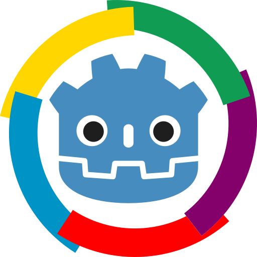

<h1> Godot engine Francophone</h1>

## Ce que nous recherchons?
Des personnes motivées qui veulent participer a quelque chose de **grand**.

Il ne s'agit pas seulement de maintenir/modérer un serveur discord mais aussi de gérer la communauté Francophone de Godot Engine.

## Qui peut postuler?
Toute personne ayant atteint la majorité (18 ans minimum)

## Comment postuler?
1. Créez-vous un [compte github](https://github.com/join?source=header-home)
2. Créez une nouvelle **Issues** et utilisez le modèle (_template_) **Candidature** (ou [cliquez ici](https://github.com/Godot-Engine-Francophone/recrutement/issues/new?assignees=&labels=&template=candidature.md&title=%5BCandidature%5D+votre+pseudo))
4. Remplissez le formulaire puis envoyez.

## Quand aura-t-on le verdict?
A l'issue du vote
